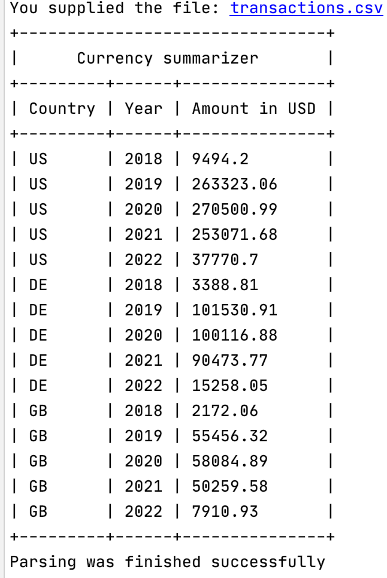

# Installation

- Install [RVM](https://rvm.io/) on you machine

`gpg2 --recv-keys 409B6B1796C275462A1703113804BB82D39DC0E3 7D2BAF1CF37B13E2069D6956105BD0E739499BDB`

`\curl -sSL https://get.rvm.io | bash -s stable`

- Install ruby 2.7.4 

`rvm install 2.7.4`

- Install bundler

`gem install bundler`

- Install dependencies

`bundle`

# Usage

Run in console `thor converter:parse transactions.csv`

# Explanation

Inflation rates by year [from this article](https://www.officialdata.org/us/inflation/1635?amount=1)

[Calculator](https://data.bls.gov/cgi-bin/cpicalc.pl) for additional checks 

Currency exchange rates [by months](https://www.x-rates.com/average/?from=USD&to=GBP&amount=1&year=2022)

# Example

